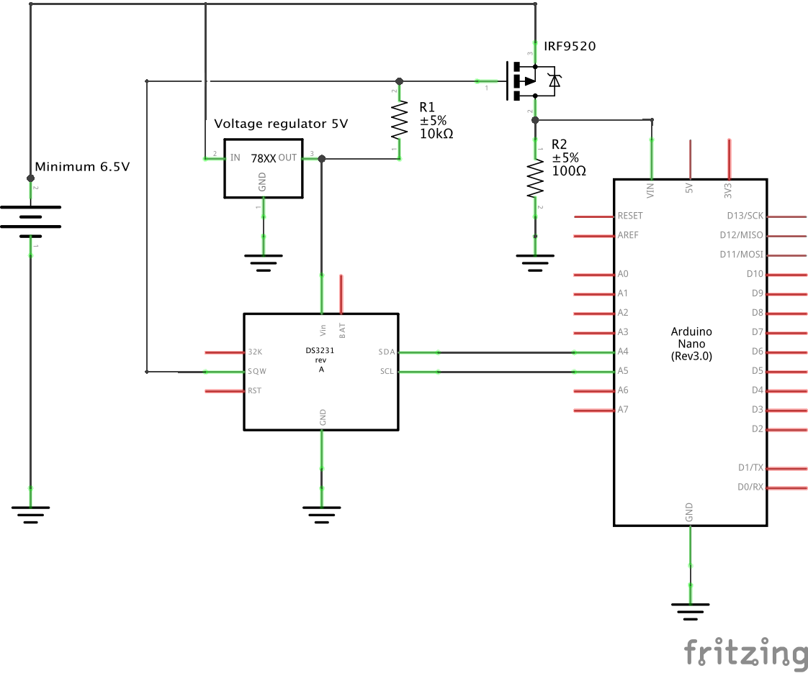

# How to save power with the Arduino Nano 33 IoT by shutting down the power and wake up on RTC alarm?

## How to shut down the power of the Arduino Nano 33 IoT and wake up on a specific time with the RTC clock?

In most data capture projects, the microcontroller is spending a tremendous amount of time doing nothing (waiting or sleeping). During this sleeping time, the power is consumed and the batteries are going down. In order to keep your project alive on months/years on the battery, the best is to minimize the power consumption while the sleeping cycle.

The approach described here allows to:

- Shutdown all the power of the circuit during the sleep cycle.
- Wake up at pre-defined intervals (every minute, every hour, every day or at a specific moment).
- Consume only the power required for the RTC clock.

What do you need?

- RTC DS3231 module (I use the ChronoDot 2.1 by Macetech but any DS3231 module with the INT pin wired is OK)
- The [library DS3231 by NothernWidget](https://github.com/NorthernWidget/DS3231)
- 1x resistor 10kOhms (pull-up to pilot the MOSFET)
- 1x resistor 100Ohms (pull-down for the power supply of the Nano)
- 1x MOSFET P-channel (I use the IRF9520)
- 1x voltage regulator for the RTC DS3231 (I use the Pololu S7V7F5 but any voltage regulator aligned with the VCC of your DS3231 is OK)

The schematics is quite simple:

If you want to reproduce this circuit on a breadboard:

The behaviour is easy to understand:

- The Arduino Nano 33 IoT is piloting the RTC clock via I2C bus to set the alarm and clear the alarm.
- The alarm of the RTC clock generates an interrupt which activate the MOSFET.
- The Arduino Nano 33 IoT is powered through the MOSFET.
- The program is running only once and go every time through the `setup()` and `loop()` functions.

You will notice that the main power supply is at 6.5V minimum. It is to guarantee enough voltage at the output of the MOSFET as the Nano 33 IoT likes to have more than 5V on Vin when there is a wifi connection. The voltage regulator is only there to power the DS3231 (mine is working at 5V).

If you have other sensors to power, you can connect on the 3.3V of the Nano. When the power is shutdown, the Nano and all sensors behind will be shutdown.

If other sensors or elements have to be powered all the time at 5V, you can connect on the voltage regulator output but remember that it will drain some current.

The program below is doing:

- Blink the built-in LED 3 times fast at the startup.
- Set the alarm on the RTC to wake up every minute.
- Blink the built-in LED for 5 seconds.
- Scan the wifi available (drain a lot of power)
- Blink the built-in LED for 5 seconds.
- Clear the alarm to shut down the power.

[See the source code](https://github.com/ostaquet/arduino-nano-33-iot-ultimate-guide/blob/master/src/PowerOnTimer/PowerOnTimer.ino)
